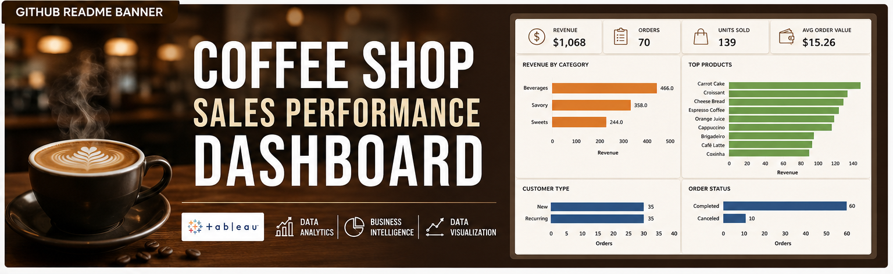
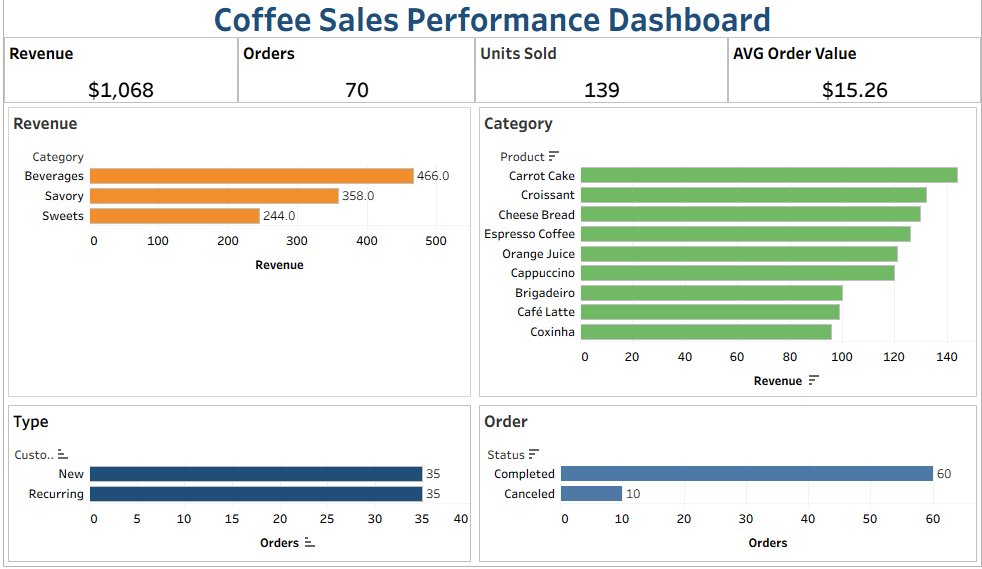

# ☕ Coffee Shop Sales Performance Dashboard


---


---

## 📌 Project Overview

This project was developed to analyze the sales performance of a coffee shop business using Tableau.

The dashboard provides a comprehensive view of key sales metrics, product performance, customer behavior, and operational indicators, supporting data-driven decision-making.

---

## ❓ Business Problem

Coffee shop managers need visibility into sales performance, customer behavior, and product demand to optimize operations and maximize revenue.

Without a centralized dashboard, identifying top-performing products, customer trends, and operational issues becomes difficult.

---

## 💡 Business Solution

An interactive Tableau dashboard was developed to consolidate sales data into actionable insights, allowing users to monitor KPIs, analyze category performance, evaluate customer segments, and track order status.

---

## 🎯 Business Questions

The dashboard was designed to answer the following business questions:

- What is the total revenue generated?
- How many orders were placed?
- What is the average order value?
- Which product categories generate the highest revenue?
- What are the top-selling products?
- What is the distribution of new and recurring customers?
- How many orders were completed or canceled?

---

## 📊 Dashboard

🔗 **Tableau Public:**  
[Coffee Shop Sales Performance Dashboard](https://public.tableau.com/app/profile/marcos.rogerio5761/viz/CoffeeShopSalesPerformanceDashboard_17833689531360/Dashboard1)

---

## 📈 KPIs

The dashboard tracks the following key performance indicators:

- Total Revenue
- Total Orders
- Units Sold
- Average Order Value
- Revenue by Category
- Top Products Performance
- Customer Type Distribution
- Order Status Analysis

---

## 🛠️ Technologies

- Tableau Public
- Microsoft Excel / CSV
- Data Visualization
- Business Intelligence
- Data Storytelling

---

## 📂 Data Source

Sample coffee shop sales dataset containing transaction records, customer information, product categories, quantities sold, and order status.

---

## 📁 Repository Structure

```text
Coffee-Shop-Sales-Performance-Dashboard
│
├── Data
│   └── Sales_Coffee.csv
│
├── Tableau
│   └── Coffee-Shop-Sales-Performance-Dashboard.twbx
│
├── Images
│   └── Dashboard.png
│
└── README.md
```

---

## 🖼️ Dashboard Preview



---

## 🔍 Key Insights

- Beverages generated the highest revenue among all categories.
- Carrot Cake was the best-performing product.
- Customer distribution was balanced between new and recurring customers.
- Most orders were successfully completed, indicating strong operational performance.
- The dashboard provides a clear overview of sales performance and customer behavior.

---

## 🚀 What I Learned

Through this project, I strengthened my skills in:

- Tableau Dashboard Development
- KPI Design and Tracking
- Data Visualization Best Practices
- Business Performance Analysis
- Data Storytelling
- Dashboard Layout and Formatting
- Publishing Projects on Tableau Public
- Portfolio Development with GitHub

---

## 👨🏾‍💻 Author

**Marcos Rogério da Silva**

Trade Marketing | Merchandising | Business Intelligence | Data Analytics

### Connect with me

- GitHub: https://github.com/marcosrdevbr
- LinkedIn: https://www.linkedin.com/in/marcos-rogerio-017923302/
- Tableau: https://public.tableau.com/app/profile/marcos.rogerio5761/vizzes

Feel free to connect or share feedback about this project.

---

## ⭐ If you found this project interesting

If you enjoyed this project or found it useful, feel free to connect with me on LinkedIn or explore my other repositories on GitHub.

Thank you for visiting my portfolio!
